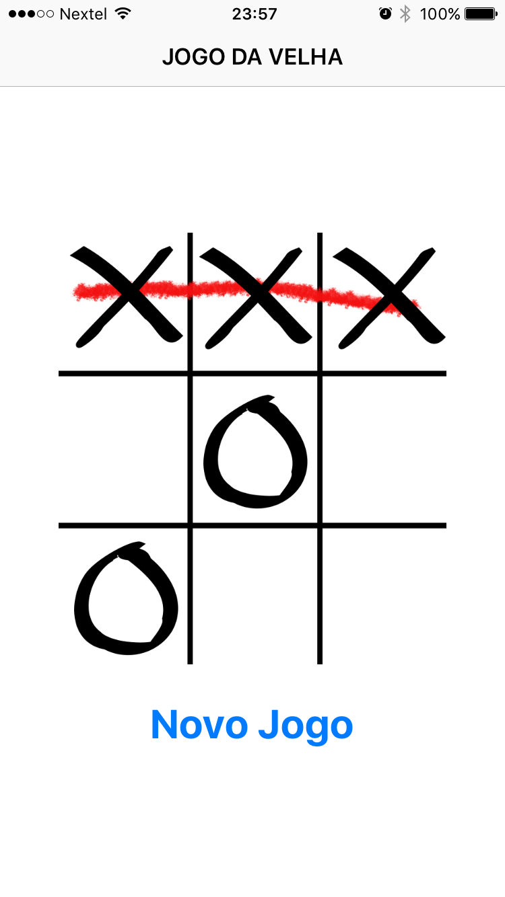

# jogodavelha-swift

Aplicação de referência, cujo objetivo é exemplificar o uso de Swift 3 para implementação de um jogo simples para iOS. 

## Resumo

Baixando este exemplo você vai encontrar o uso de:
 - Storyboard
 - UILabel
 - UIImage
 - UIButton
 - UIImageView
 - UIViewController
 - UIView

Além disso, tem também:
 - Autolayout

## Screenshots

## Construído utilizando

* [Xcode 8](https://developer.apple.com/xcode) - IDE de desenvolvimento.

## Autor

* **João Carlos Brandão Morgado** - *Trabalho Inicial* - [joaobrandao](https://github.com/jocabrandao)

## Licença

MIT 
